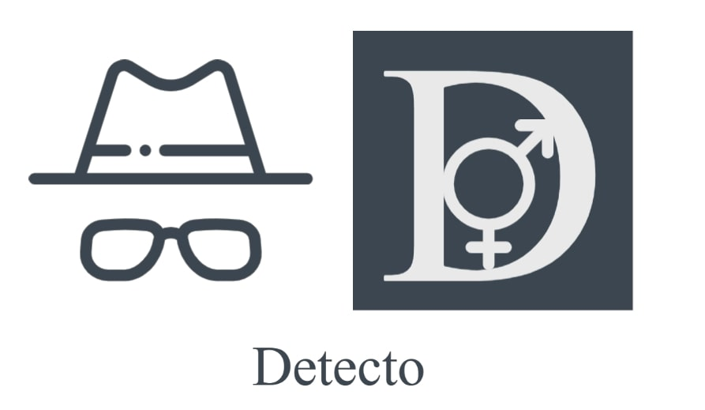
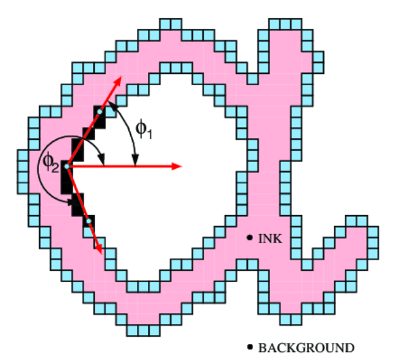
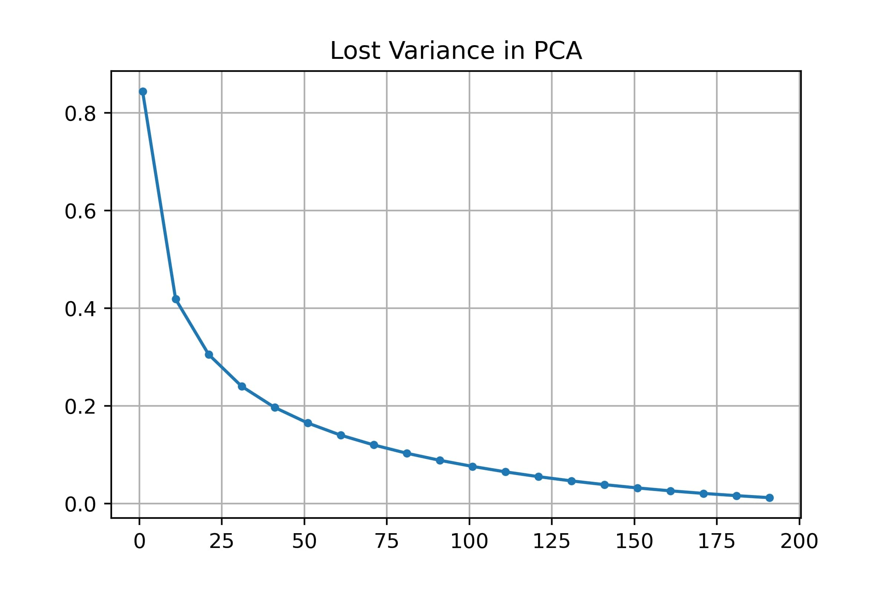
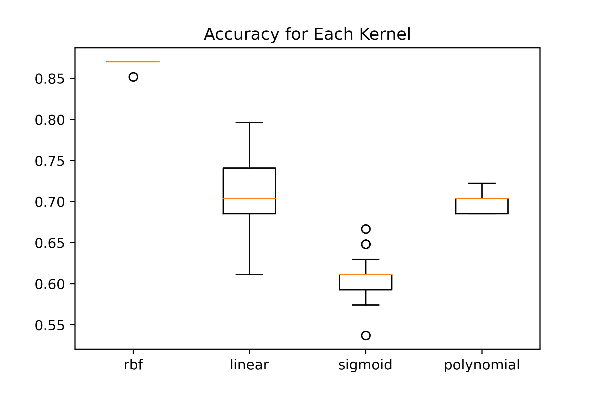
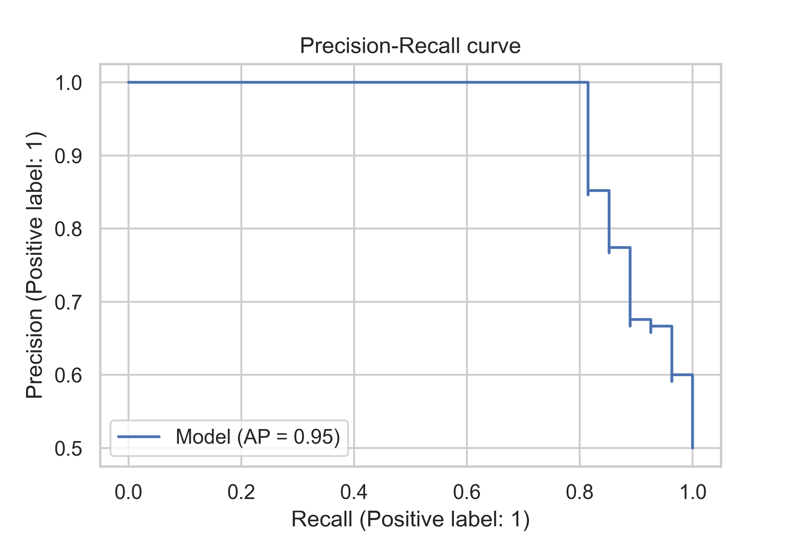
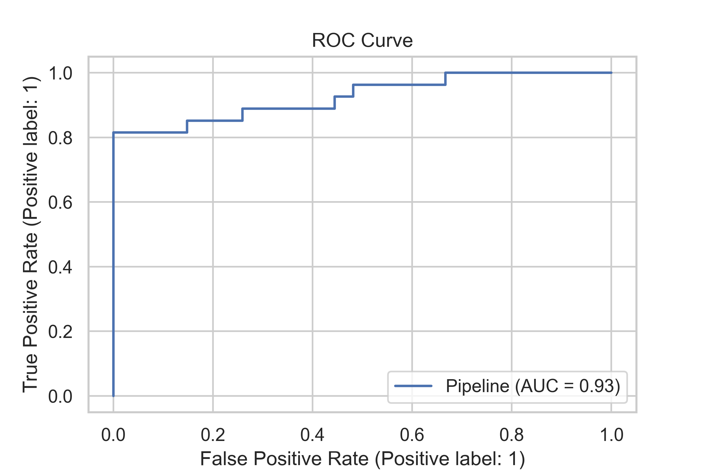

# Detecto

## A Handwriting Based Gender Classification Model

## Introduction to the problem

Handwriting is an important piece of evidence that is examined in the questioned document to ensure its authenticity. Handwriting is the written speech of an individual who has characteristics that set him apart from others. It is a learned skill and a complex perceptual-motor task, also known as a neuromuscular task.Visual observation, outline conception, central nervous system pathways, and the anatomy and physiology of the bones and muscles of the hand and arm all work together to produce the desired output. Writing is a function of the conscious and subconscious mind, as well as of the body's motor, muscular, and nerve movements.Handwriting has distinct characteristics that are unique to each individual and can be used for personal identification.

In an extended handwriting sample, no two people write exactly alike, according to the basic principle of handwriting identification. The possibility of distinguishing the gender of the writer from his/her handwriting has been the pursuit of many investigations. Handwriting is said to be brainwriting, so the thinking of a male differs greatly from that of a female due to hormonal involvement and differences in their physiology, which may not only alter their neuromotor functioning, as a result of which writing work is done but also their way of thinking differs and thus characteristic. So handwriting which is observed during the examination may be proven to be showing discriminatory features in male and female handwriting.

## Project Pipeline

Our system is implemented using two sub-pipelines: the data pipeline and the inference (model) pipeline. This separation of work between how we pre-process the data and how we build the model was essential for fast development and experiment, it also helped to make the model ready for deployment.

### Data Pipeline

This pipeline is used for transforming input images to the required shape before using it in the model. It passes images through a preprocessor which extracts contours from the image and it passes these contours to the feature extractor to generate feature vectors.

 

### Model Pipeline

This pipeline is responsible for generating the predictions from the given feature vectors. The pipeline starts by normalizing the data to reduce the numerical difference between the features then it reduces the number of features using PCA then uses a classification algorithm such as Random Forest or SVM to get the prediction.

 

### Data Flow

Another way to represent the system's general architecture is by representing the output and input data shape between each module. This representation is very useful for debugging as many errors happen because of wrong input shapes.

 

## System Modules

### Preprocessing

The main task for the preprocessing module is to clear the data and fix any issues in it. After we explored the data and do some analysis on it we found some issues and we tried to solve them as follows:

#### Data Unbalancing

The data unbalancing problem happens when the samples given for a class are much more than the sample for the second the other class. This can damage the generalization performance for the model as it will tend to classify all points to the first class.

 

To mitigate this problem we did the following:

- Created the dev set with an equal number of labels for each class so that we can rely on it for  measuring generalization performance.

- The number of males in the train set is slightly higher than the number of females by about 30 examples. This threshold was found empirically as we wanted to use as much data as we can but were constrained to the performance of the females class

#### Shadows on Images

The bottom third or so of the image had hand shadows due to poor imaging conditions, no useful information was in that area, but it proved to be an issue during preprocessing due to thresholding transforming the shadow into a black blob. This was overcome by unifying the color of the bottom third or so of the image to a gray color.

### Feature extraction

#### Hinge Features

It capture information about the curvature and slant / angle of line at the point of intersection between two lines. This is done by computing the joint probability distribution of the orientations of the two legs. This extractor has 2 parameters. The length of each leg, and the number of angle bins. In our implementation we obtain legs by finding all contours in the image, then we filter out any contours shorter than 25 pixels. We then compute the angles between each two neighboring contours and construct a histogram using the angles 1, 2 (demonstrated in the above figure).

  

#### COLD Features

Is based on the shape context descriptor. In a nutshell, we pick points from the contours of the shape, we then construct a set of vectors between the point pi and all other n-1 points, we then build a histogram based on the relative coordinates  between  pi  and the n-1 other points. COLD further uses dominant points; such as straight, angle-oriented features and curvature over contours of handwritten text components.

#### PCA

This module helped us speed up our training by analyzing our components/features and sorting them descending by variance. This helped us to focus on more discriminatory features and thus train faster with fewer features and lower resource usage, allowing faster experimentation. For choosing the number of components we used the elbow method as illustrated in this graph and we chose a value between 80 to 90 components.

 

### Model Selection

#### Random forest

We decided to use the random forest as our first model for various reasons:
They are based on trees, so the scaling of the variables doesn't matter. Any monotonic transformation of a single variable is implicitly captured by a tree.
They use the random subspace method and feature bagging to prevent overfitting by decreasing the correlation between decision trees considerably. Hence, increasing the mean accuracy of predictions automated feature selection is built in. For Hypertuning the number of estimators parameter we used a grid search from 10 to 1000 with a step size equal to 50 and get the following results

  

#### SVM

Was our final model. The reason is that SVM is one of the most robust and accurate among the other classification algorithms, as It can efficiently perform a non-linear classification using what is called the kernel trick, implicitly mapping their inputs into high-dimensional feature spaces. Furthermore, SVM is effective in cases where the number of dimensions is greater than the number of samples, which is the case in our problem.
For choosing the best hyper parameters we started by using a polynomial kernel and searched for the best degree but as we chose from the graph the results were decreasing as the model was overfitting so we tried the rbf, liner and sigmoid kernel. To model was the uncertainty between each run we created each experiment about 100 times then plotted the results using boxplot graph as shown

  

#### SVMs outperformed Random Forests, averaging 85%-89% accuracy on different runs

## Evaluating Classifiers

When evaluating a machine learning classifier the traditional method of calculating accuracy is not the best option, despite the fact that it is simple and interpretable, it does not take into account how the data is distributed. This could be critical and lead to an incorrect conclusion. So far, we've used the Precision, Recall, and F1 score models.

- Precision is the ratio of correctly predicted positive observations to the total predicted positive observations. $Precision = \dfrac{TP}{TP + FP}$

- Recall (Sensitivity) - Recall is the ratio of correctly predicted positive observations to all observations in the actual class. $Recall = \dfrac{TP}{TP +FN}$

- F1 Score is calculated as the weighted average of Precision and Recall. As a result, this score considers both false positives and false negatives. It is not as intuitive as accuracy, but F1 is usually more useful than accuracy, especially if the class distribution is uneven. Accuracy works best when the costs of false positives and false negatives are comparable. If the cost of false positives and false negatives differ significantly, it is preferable to consider both Precision and Recall.
$F1 Score = 2 *\dfrac{Recall*Precision}{Recall + Precision}$

## Results

### Precision-Recall Curve

  

### ROC Curve

  

### Inference Time

  

## Enhancement & Future Work

Despite achieving an average of 85% or more on our small, handmade dataset, our work could be improved in several aspects:

- Larger datasets.
- Better balanced data.
- Better imaging conditions.
- Using more advanced classifiers such as deep neural networks and CNNs.
